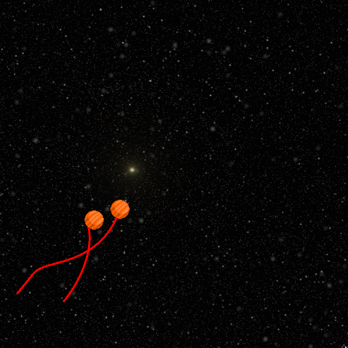

# Coding From Scratch
Stray Basilisk Coding Stream Project Archive!

In the Coding From Scratch streams, we usually implement a brand new project each week.

Check out the streams live on Twitch each Thursday at https://twitch.tv/StrayBasilisk.

They are also archived on YouTube at https://www.youtube.com/watch?v=HHvN3BuT2ew&list=PLljr03m9JFTz8HBLSK_FVmD0kQfMPXVk_

Past projects include:
* Clones of classic games
* Demos of fundamental gamedev concepts & techniques
* Graphical experiments and visualisations
* Interactive toys
* Twitch and Discord bots

